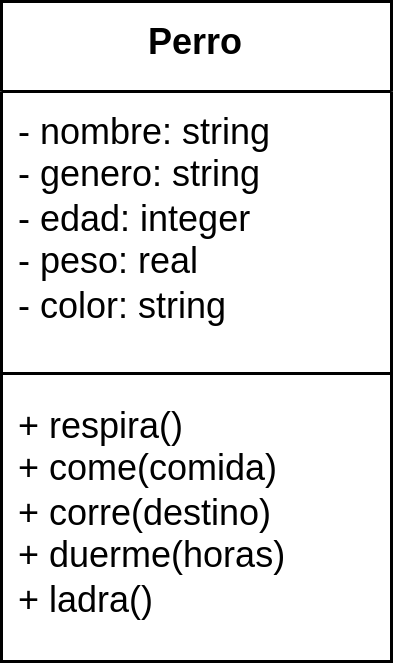
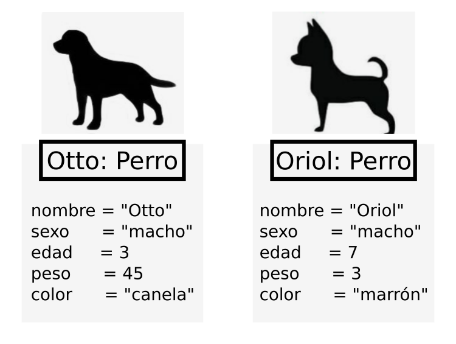
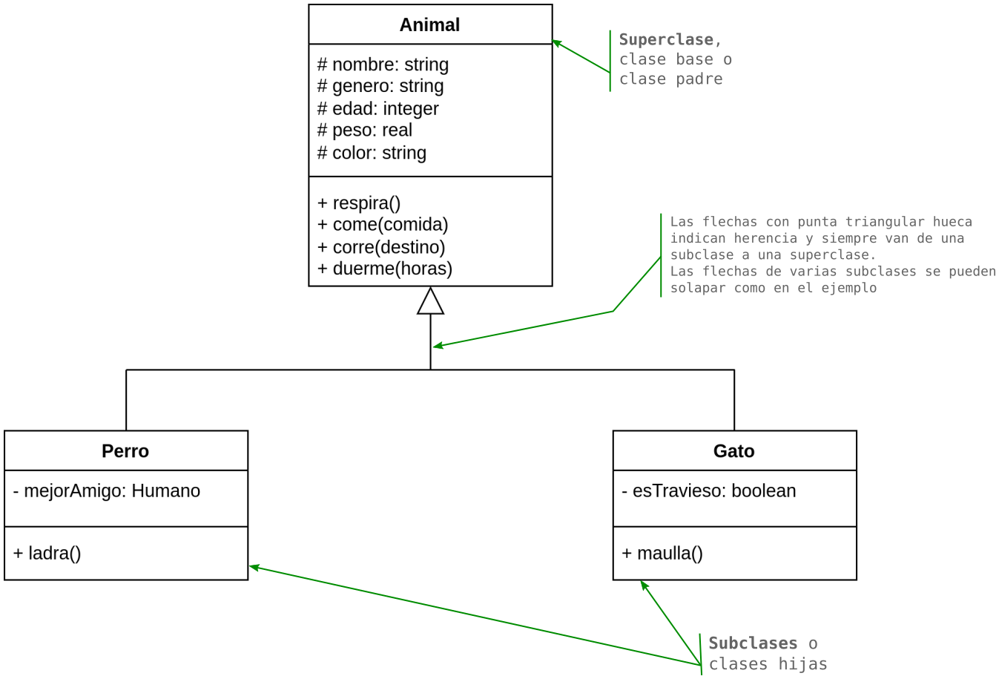
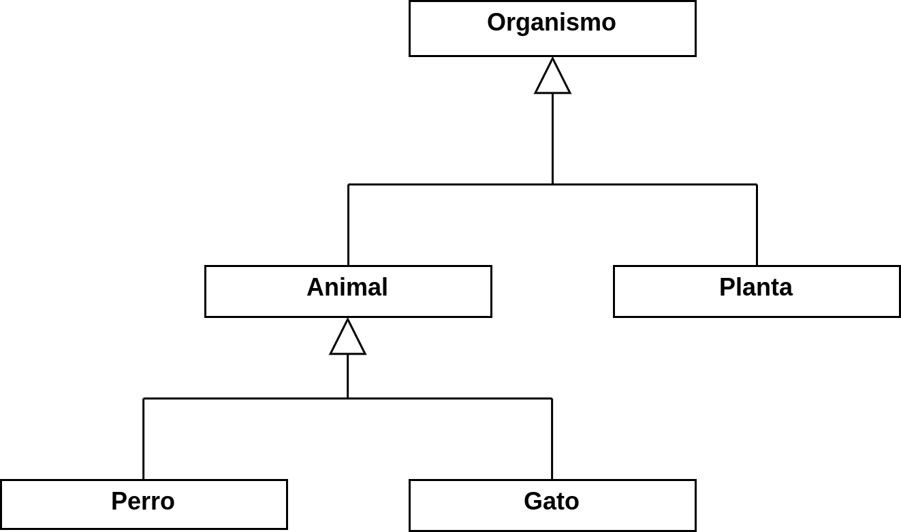
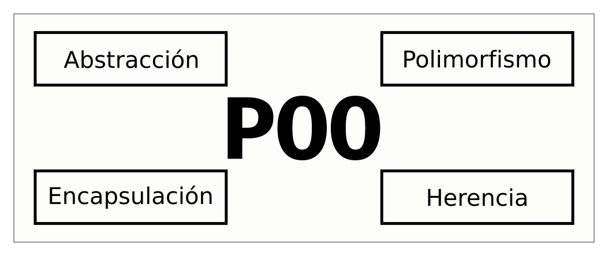
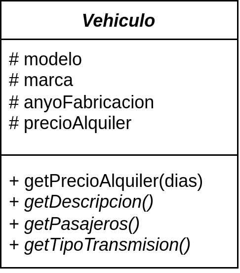
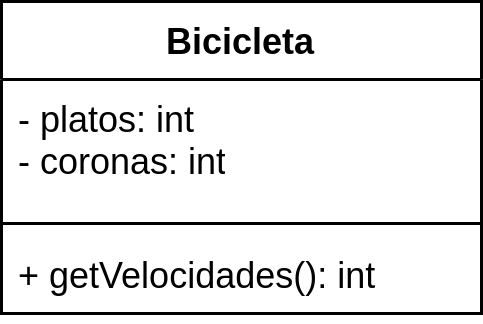

# Fundamentos de la POO
La Programación Orientada a Objetos (POO) es un paradigma de programación basada en la idea de envolver bloques de información y su comportamiento relacionado en lo que se denominan **objetos**, que se construyen a partir de un grupo de "planos" definidos por un programador a través de las denominadas **clases**.

En definitiva: los programadores crean planos llamados clases que se usan para construir objetos.

En los POO, de una complejidad relativa, hay multitud de clase y relaciones entre las mismas, lo que hace necesario usar un lenguaje conceptual para describirlas, se denominan diagramas de clase y se usa el lenguaje conceptual **UML**. Antes de ver cómo se usa este lenguaje es necesario entrar en los fundamentos de la POO.

> El Lenguaje Unificado de Modelado (UML, por sus siglas en inglés, Unified Modeling Language) es un lenguaje de modelado de sistemas de software respaldado por el Object Management Group (OMG).
> Así, este lenguaje UML no solo se utiliza para el describir las clases y sus relaciones, sino para otro tipo de diagramas. En este tema nos centramos en los Diagramas de Clase de UML.

## Objetos y clases
¿Te gustan los perros? Espero que sí, porque te voy a explicar los conceptos de clase y objeto a partir de ejemplos relacionados con estas maravillosas criaturas.



Lo que ves justo arriba es un **diagrama de clases de UML** que aprenderemos a interpretar y construir más adelante, aunque seguramente te resultará intuitivo que dicho diagrama describe una clase llamada *Perro* con una serie de atributos descritos en la primera parte y un conjunto de operaciones en la segunda parte.

Digamos que tienes un perro llamado *Otto*. *Otto* es un objeto, una instancia de *Perro*. Cada perro tiene varios atributos estándar: nombre, sexo, edad, peso, color, etc. Estos son los **atributos de la clase**.

Además, todos los perros se comportan de manera similar: respiran, comen, corren, duermen y landran. Estos son los **métodos de la clase**.

En general, **podemos referirnos** a los **atributos** y los **métodos** de una clase como **miembros** de la clase.

Resumiendo:

- Una clase tiene un **nombre** y un **conjunto de miembros: atributos y métodos**
- Las **clases** son los planos que se usan para crear **objetos**
- A los **objetos** de una clase se les denomina **instancias de una clase**
- Cada objeto tiene un estado definido por los valores que hay en sus **atributos**
- Estos objetos tienen un comportamiento dado marcado por sus **métodos**

En la siguiente imagen se muestran dos perros (objetos) que son instancias de la clase *Perro*. Se llaman Otto y Oriol:



Se ha usado la misma clase, el mismo *plano*, para instanciar a Otto y a Oriol, dos objetos de la clase *Perro*, dos instancias de la clase *Perro*, como quieras decirlo. La diferencia está en los valores de los atributos.

Hemos usado, por tanto, **un plano** (la clase) para construir dos objetos.

## Jerarquías de clase
Hasta ahora todo va muy bien, solo tenemos una clase, por lo que es bastante fácil de entender. Pero no suele ser tan fácil. Como ya he comentado al principio los POO suelen tener muchas clases y algunas se relacionan con otras formando jerarquías. Veamos qué significa esto.

Imagina que tu vecino tiene un gato llamado Garfield. Los gatos no son tan simpáticos como los perros, y además les tengo alergia, pero tienen muchas cosas en común: nombre, sexo, edad y color, son atributos tanto de perros como de gatos. Los gatos también pueden respirar, dormir y correr igual que los perros, por lo que podríamos definir una clase base llamada *Animal* que definirá los atributos y los comportamientos comunes:



Una clase padre, como la clase *Animal*, se denomina **superclase** (o **clase base**). Sus hijas, como las clases *Perro* y *Gato*, se denominan **subclases** (o **clases derivadas**). Las subclases heredan el estado y comportamiento de su padre (la superclase) y se limitan a definir atributos o comportamientos que son diferentes. Por lo tanto la clase *Perro* contendrá el método ladra y, la clase *Gato*, el método maulla.

Asumiendo que tenemos una tarea relacionada, podemos ir más lejos y extraer una clase más genérica para todos los *Organismo* vivos, que se convertirá en una superclase para *Animal* y *Planta*. En esta jerarquía de clases, la clase *Perro* lo hereda todo de las clases *Animal* y *Organismo*:



Como ves en el diagrama UML de arriba, podemos simplificarlo si es más importante mostrar sus relaciones que sus contenidos.

## Los pilares de la POO
La POO se basa en cuatro pilares o conceptos que lo diferencian de otros paradigmas de programación, a saber: abstracción, polimorfismo, encapsulación y herencia.



### Abstracción
En la POO, la abstracción es el proceso de identificar las características y comportamientos esenciales de un objeto en un dominio específico, y representarlas en un modelo que pueda ser utilizado para construir objetos reales. La abstracción nos permite enfocarnos en lo más importante de un objeto y ocultar los detalles irrelevantes para el problema que estamos tratando de resolver.

En la práctica, en los lenguajes de POO tenemos la posibilidad de crear clases abstractas con métodos abstractos que, junto a la herencia, permiten identificar las características y comportamientos esenciales de los objetos que se instancian vía clases hijas de la clase abstracta.

Imagina un sistema para una empresa de alquiler de vehículos donde los usuarios pueden alquilar diferentes tipos de vehículos: coches, motos y bicicletas. Cada tipo de vehículo tiene atributos y métodos específicos, pero todos los vehículos comparten algunos atributos y métodos en común, como su modelo, marca, año de fabricación y precio de alquiler. Otros comportamientos y atributos pueden y deben ser abstractos, como: la descripción, el número de pasajeros y el tipo de transmisión.



La implementación de la clase *Vehiculo* en Java quedaría tal cual te muestro a continuación:

```java
public abstract class Vehiculo {
    private String modelo;
    private String marca;
    private int anioFabricacion;
    private double precioAlquiler;

    public Vehiculo(String modelo, String marca, int anioFabricacion, double precioAlquiler) {
        this.modelo = modelo;
        this.marca = marca;
        this.anioFabricacion = anioFabricacion;
        this.precioAlquiler = precioAlquiler;
    }

    public double obtenerPrecioAlquiler(int diasAlquiler) {
        return precioAlquiler * diasAlquiler;
    }

    public abstract String obtenerDescripcion();

    public abstract int obtenerCapacidadPasajeros();

    public abstract String obtenerTipoTransmision();
}
```

Como ves no importa el detalle de la implementación de los métodos abstractos, sino que nos centramos en lo importante. A partir de estas clases abstractas se crean implementaciones concretas como podría ser un clase *Coche*, *Motocicleta* o *Bicicleta*, por ejemplo.

### Encapsulación
La encapsulación es uno de los conceptos fundamentales de la POO que se utiliza para proteger la información y el comportamiento de un objeto, limitando su acceso a otros objetos del programa.

Así, con la encapsulación, los objetos tienen la capacidad de esconder partes de su estado y comportamiento, exponiendo únicamente una interfaz al resto del programa.

Además, la encapsulación también permite la ocultación de la complejidad interna de un objeto y su implementación, lo que facilita el mantenimiento del código y evita errores en el programa. En resumen, la encapsulación es una forma de proteger y controlar el acceso a los datos y comportamiento de los objetos, y es un concepto clave en la programación orientada a objetos.

Las interfaces y las clases y métodos abstractos de la mayoría de los lenguajes de programación se basan en conceptos de abstracción y encapsulación. En los lenguajes modernos de programación orientada a objetos, el mecanismo de la interfaz (declarado normalmente con la palabra clave interface o protocol) te permite definir contratos de interacción entre objetos. Ésta es una de las razones por las que las interfaces sólo se interesan por los comportamientos de los objetos, y también el motivo por el que no puedes declarar un campo en una interfaz.

Para ofrecer la encapsulación, los lenguajes de programación disponene de mecanismos como:

- Visibilidad de atributos métodos: *private*, *protected* y *public*.
- Interfaces para definir contratos de interacción entre objetos.
- Clases abstractas para especificar métodos a implementar por las clases hija.

Aquí te muestro una clase *Bicicleta* en la que se ocultan los atributos *platos* y *coronas*, pero permite acceder a las velocidades que tiene la bicicleta a través del método *getVelocidades*:



### Herencia
La herencia, como se ha visto anteriormente, permite crear nuevas clases a partir de otras ya existentes. La principal ventaja de la herencia es la reutilización ya que si quieres crear una clase ligeramente diferente a una ya existente, no hay necesidad de duplicar el código. En su lugar, extiendes de la clase ya existente y colocas las funcionalidades diferentes en la nueva clase.

La consecuencia del uso de la herencia es que las subclases tienen la misma interfaz que su clase padre. No puedes esconder un método en una subclase si se declaró en la superclase. También debes implementar todos los métodos abstractos, aunque no tengan sentido en tu subclase.

En la mayoría de los lenguajes de programación, como en Java, solo se puede extender una clase: herencia simple.

### Polimorfismo
El polimorfismo es un concepto que se refiere a la capacidad de un objeto de tomar muchas formas diferentes. En programación orientada a objetos, el polimorfismo permite que un objeto pueda ser tratado como si fuera de un tipo diferente al que realmente es. Esto significa que, dependiendo del contexto, un objeto puede comportarse de diferentes maneras.

Por ejemplo, imagina que tienes un programa que maneja diferentes formas de transporte, como coches, motocicletas y bicicletas. Cada forma de transporte tiene su propia lógica para acelerar y frenar. Con el polimorfismo, puedes crear un método para acelerar y frenar que tome cualquier objeto de transporte como argumento, y el programa se encargará automáticamente de llamar al método adecuado para cada objeto, independientemente de si es un coche, una motocicleta o una bicicleta. Esto significa que puedes escribir código más genérico y reutilizable, y que no tienes que preocuparte por el tipo específico de objeto que estás manejando en cada momento.

En resumen, el polimorfismo permite que los objetos puedan comportarse de manera diferente en función del contexto en el que se utilicen, lo que proporciona una gran flexibilidad y versatilidad en la programación orientada a objetos.
