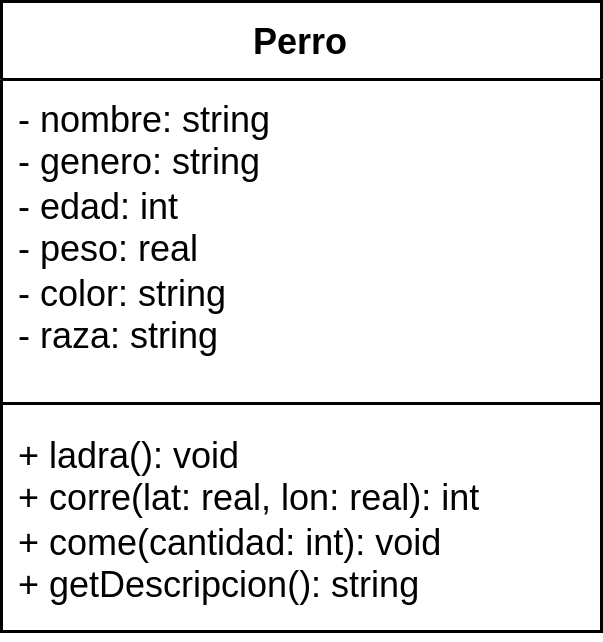
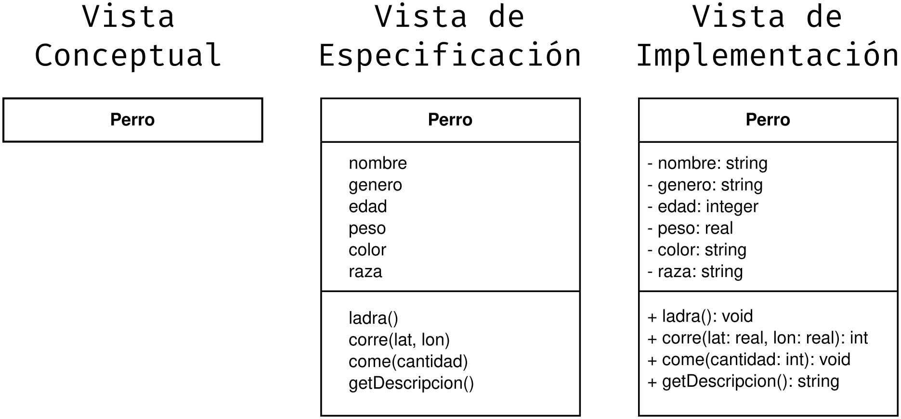
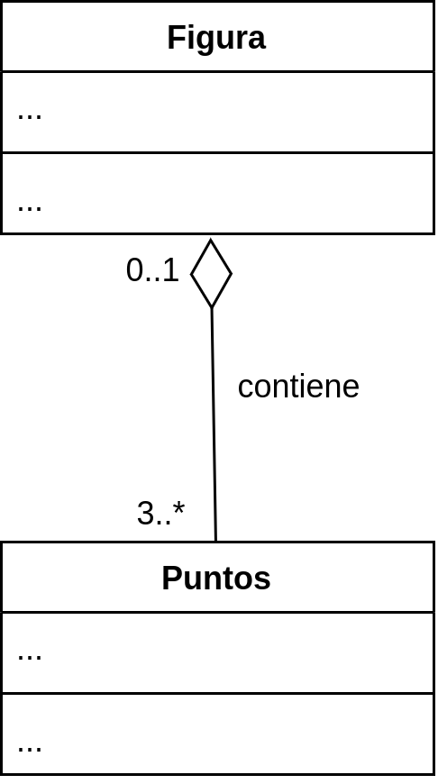
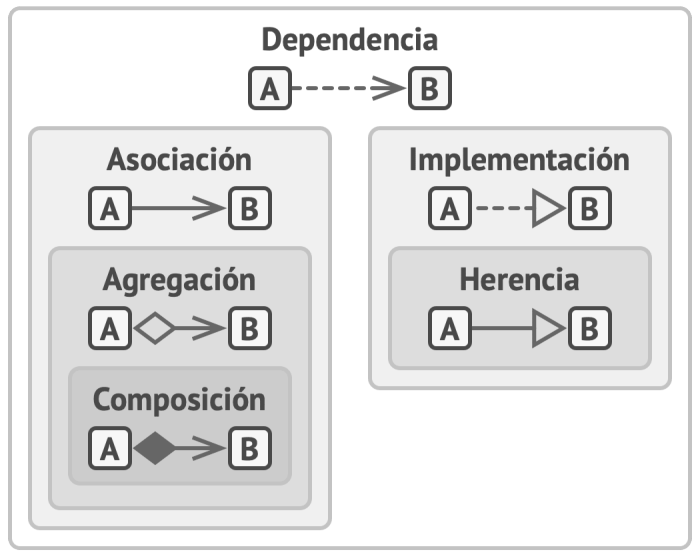

# UML: Diagrama de clases
UML (Unified Modeling Language) es un lenguaje de modelado visual utilizado en el desarrollo de software para representar gráficamente los sistemas de software. UML proporciona un conjunto de diagramas que permiten a los desarrolladores representar diferentes aspectos de un sistema, como su estructura, comportamiento y relaciones entre los componentes. Al utilizar UML, los desarrolladores pueden comunicar de manera más efectiva y comprender mejor los requisitos del sistema, lo que les permite diseñar e implementar soluciones más eficaces y de alta calidad.

UML cuenta con varios tipos de diagramas, los cuales muestran diferentes aspectos de las entidades representadas. En esta unidad nos centramos en los denominados diagrama de clases.

Un diagrama de clases es una representación visual de las clases y relaciones entre ellas en un sistema orientado a objetos. El diagrama muestra la estructura de un sistema de software, incluyendo las **clases**, sus **atributos y métodos**, y las relaciones entre ellas, como **la herencia, la asociación, la composición y la agregación**. El objetivo principal de un diagrama de clases es proporcionar una vista general del sistema y permitir a los desarrolladores entender la estructura y organización del sistema, lo que les ayuda a diseñar, implementar y mantener el software de manera efectiva. El diagrama de clases es una **herramienta esencial en la fase de diseño de software** y es utilizado por los desarrolladores para documentar el sistema y comunicar sus ideas a otros miembros del equipo.

## Software para diagramas UML
Existen diferentes opciones pero, por su simplicidad y rapidez a la hora de construir diagramas de clases, os recomiendo estas opciones:

- draw.io (herramienta online)
- DIA

Si buscas por la Web verás que hay estupendas herramientas de modelado de diagramas UML que, incluso, pueden generar el código fuente en diferentes lenguajes de programación a partir de los diagramas de clases, pero la construcción de dichos diagramas es más tedioso.

También se pueden hacer los modelos en papel y de forma manual, no obstante, no te lo recomiendo porque es habitual tener que editar y corregir los modelos.

## Modelado de una clase
Para representar una clase se usa una caja con tres partes:

- En la primera parte, arriba, viene el nombre de la clase
- Luego la lista de atributos
- Por último, la lista de métodos

Para los atributos se puede indicar el tipo de dato y para los métodos los parámetros que recibe y el tipo de valor que devuelve. En ambos casos se puede indicar la visibilidad por medio de un prefijo: (-) para privado, (#) para protegido y (+) para público.

Te muestro un ejemplo. Sí, uno más en el que el perro es el protagonista:

Según el estándar UML, es obligatorio especificar tanto el tipo de los atributos como los tipos de los parámetros y del resultado que devuelven los métodos. En UML, cada atributo o parámetro debe estar asociado con un tipo de datos que lo defina, y en el caso de los métodos, se debe especificar tanto el tipo de retorno como el tipo de los parámetros.

En la práctica, aunque el estándar UML establece que es obligatorio especificar los tipos de datos de los atributos, parámetros y resultados de los métodos, en algunos casos se puede omitir esta información si el contexto es lo suficientemente claro y el diagrama de clases se utiliza como una herramienta de comunicación informal entre los miembros del equipo de desarrollo.

Así, estos diagramas de clases, se pueden especificar con un mayor o menor nivel de detalle, lo que permite utilizarlos desde una perspectiva **conceptual**, de **especificación** o de **implementación**, como puedes ver en la siguinete imagen:

Sin embargo, en general, es recomendable especificar siempre los tipos de datos en los diagramas de clases para garantizar una mayor precisión y consistencia en la definición de los sistemas de software, así como para facilitar su comprensión y mantenimiento a largo plazo. Además, el uso de tipos de datos adecuados también puede contribuir a mejorar la eficiencia y la seguridad de los sistemas de software.

## Modelado de una interfaz
En POO, una interfaz es un conjunto de métodos que representan un contrato que una clase puede cumplir. Es una especificación de los métodos que una clase debe implementar sin especificar cómo se deben implementar, lo que permite a las clases que implementan la interfaz proporcionar diferentes implementaciones de los métodos. Las interfaces se utilizan para permitir la interoperabilidad entre objetos de diferentes clases, ya que los objetos pueden interactuar a través de una interfaz común sin conocer los detalles de las implementaciones subyacentes. Las interfaces también se utilizan para lograr la abstracción y la encapsulación en los sistemas de software, lo que puede facilitar su diseño, implementación y mantenimiento.

Para modelar una interfaz tan solo tienes que añadir arriba del nombre de la clase que es una interfaz: **\<\<interface\>\>**. Evidentemente, la parte donde se indican los atributos, en una interfaz, está vacía:

En esta interfaz *IPerro* se obliga a las clases que la implementen a definir los métodos que se listan, todos, sin excepción.

## Modelado de una clase abstracta
Una clase abstracta es una clase que no puede ser instanciada directamente, es decir, no se puede crear un objeto de ella. Su principal función es ser una clase base para otras clases, las cuales heredarán sus atributos y métodos. En una clase abstracta, se pueden definir tanto métodos concretos como métodos abstractos, los cuales no tienen implementación y deben ser implementados en las subclases que heredan de la clase abstracta.

En UML se indican las clases abstractas escribiendo su nombre en cursiva y los métodos abstractos también se escriben en cursiva. No obstante, también se puede puede poner encima del nombre de la clase: **\<\<abstract\>\>** para denotar que la clase es abstracta. De esta manera queda más claro.

Aquí te dejo un ejemplo de modelado de una clase absracta en UML:

Como ves hay atributos (todos *protected*) y métodos, de los cuales 3 son abstractos:

- emitirSonido: cada animal emite un sonido diferente, así que el animal concreto que extienda de esta clase abstracta será la responsable de emitir el sonido correspondiente implementando el método emitirSonido.
- moverse: nuevamente, cada animal se mueve de forma diferente, así que será la clase concreta que extienda de esta la que decida cómo moverse implementando dicho método.
- comer: cada animal tiene una alimentación, por lo que la clase que la extienda tendrá que implementar este método también.

## Modelando relaciones
Las relaciones en las que, seguramente, estás pensando es la **herencia** y la **implementación**, pero hay otras relaciones entre clases: **dependencia**, **asociación**, **agregación** y **composición**.

En los siguientes apartados te describo cada una de estas relaciones y te muestro ejemplos de cómo se modelan con UML.

Como verás en los ejemplos, cuando hay relaciones entre dos clases se indican:

- El nombre de la asociación.
- La multiplicidad.

Para la multiplicidad puedes usar estas opciones:

<table>
	<tr>
		<td colspan="2">Multiplicidades</td>
	</tr>
	<tr>
		<th>Multiplicidad</th>
		<th>Significado</th>
	</tr>
	<tr>
        <td>1</td><td>Uno y solo uno</td>
	</tr>
	<tr>
		<td>0..1</td><td>Cero o uno</td>
	</tr>
	<tr>
		<td>N..M</td><td>Desde N hasta M</td>
	</tr>
	<tr>
		<td>*</td><td>Cero o varios</td>
	</tr>
	<tr>
		<td>0..*</td><td>Cero o varios</td>
	</tr>
	<tr>
		<td>1..*</td><td>Uno o varios</td>
	</tr>
</table>

### Herencia
Ya te he hablado de la herencia en el apartado anterior. Aquí te vuelvo a mostrar cómo se modela dicha relación:

Se usa la flecha con punta blanca cerrada para indicar la relación de herencia, donde la clase de la que sale la fleche hereda de la clase donde está la punta de la flecha.

En el ejemplo que te muestro **Perro** y **Gato** heredan de **Animal**.

### Implementación
En la mayoría de lenguajes de POO solo se permite la herencia simple pero se pueden implementar varias interfaces. Como ya sabes no se pueden implementar clases, solo se pueden implementar interfaces.

La implementación de interfaces se indica por medio de flechas con líneas discontinuas acabadas en una punta blanca cerrada, como ves en el siguiente ejemplo:

En este ejemplo, cambiamos de dominio, dejamos a un lado el fantástico mundo de los animales y pasamos al de los coches, no tan fascinante, la verdad. En cualquier caso, todos los vehículos necesitan acelerar y frenar pero cada uno tiene un sistema para hacerlo.

Aquí, *Coche*, *Motocicleta* y *Bicicleta* implementan la interfaz Vehiculo. Por eso, la flecha con línea discontinua parten de *Coche*, *Motocicleta* y *Bicicleta* y acaban, con punta blanca cerrada, en la interfaz *Vehiculo*.
  
> Si te das cuenta se indican de la misma manera la herencia que la implementación en UML con la salvedad de que la línea es continua para la herencia y discontinua para la implementación.
  
### Dependencia
Esta es la relación más débil entre clases y se da cuando una clase usa a otra clase, normalmente en un método. Por ejemplo, imagina que una clase *Persona* usa la clase *Fecha* para, en un método dado, mostrar la fecha de nacimiento de la persona en un formato determinado.

Esta relación se representa por medio de una línea discontinua acaba en una flecha abierta hacia la clase que es usada.

### Asociación
La asociación es una relación entre dos clases que indica que una clase conoce la existencia de la otra clase y puede interactuar con ella de manera directa y permanente. Por ejemplo, una clase *Persona* puede tener una asociación con una clase *Dirección* en la que cada objeto *Persona* tiene una dirección asociada. En UML, la asociación se representa mediante una línea entre dos clases, que puede tener una etiqueta que indica la naturaleza de la asociación.

Las asociaciones representan las relaciones más generales entre clases, es decir, las relaciones con menor contenido semántico. Para UML, una asociación va a describir un conjunto de vínculos entre instancias de las clases.

Las asociaciones pueden ser bidireccionales o unidireccionales. Si son unidireccionales hay que especificar por mediode una flecha abierta la dirección de la asociación, lo que en UML se conoce como navegabilidad.

En el ejemplo siguiente, hay una relación entre *Persona* y *Dirección* donde la navegabilidad va de *Persona* a *Dirección* porque una *Persona* tiene la responsabilidad de indicar su *Dirección*, pero una *Dirección* no tiene la obligación de indicar a qué *Persona* pertenence:

### Agregación
La agregación es una relación entre dos clases en la que una clase (la clase *todo*) contiene una o varias instancias de la otra clase (la clase *parte*) y estas instancias pueden existir independientemente de la clase *todo*. Por ejemplo, una clase *Edificio* puede tener una agregación con una clase *Habitación*, en la que cada objeto *Edificio* tiene varias instancias de *Habitación*, y estas habitaciones pueden existir independientemente del edificio. En UML, la agregación se representa mediante una línea con un diamante vacío en el extremo de la clase *todo*.

Veamos un ejemplo clásico: una *Bicicleta* es un agregado de dos *Rueda*, un *Sillin*, un *Manillar*, un *Cuadro* y dos *Pedal*:

Cuando se construye una instancia (objeto) de la clase *Bicicleta* hay que construir los objetos de las partes: *Rueda*, *Sillin*, *Manillar*, *Cuadro* y *Pedal*, y formar, así, la bicicleta. Cuando se destruya el objeto *Bicicleta* no hace falta eliminar sus agregados, ya que pueden ser utilizados para formar otros objetos *Bicicleta*.

### Composición
La composición es similar a la agregación, pero con una relación más fuerte entre la clase *todo* y la clase *parte*. En la composición, las instancias de la clase *parte* no pueden existir sin la clase *todo*. Por ejemplo, una clase *Pedido* puede tener una composición con una clase *LineaPedido*, en la que cada objeto *Pedido* tiene una o varias instancia de *LineaPedido* que no puede existir sin el pedido. En UML, la composición se representa mediante una línea con un diamante lleno en el extremo de la clase *todo*.

En este ejemplo, se tiene la clase *Pedido* que consta de varias *LineaPedido* que, a su vez, tiene una asociación con un *Producto*:

## Resumen de las diferentes relaciones
Aquí te dejo una imagen que representa gráficamente las relaciones que podemos encontrar en los diagramas de clases en UML, de las más débiles a las más fuertes:

