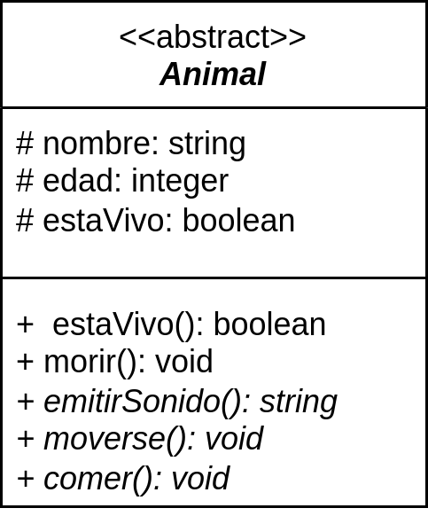

# UML: de diagrama de clases a código Java
Los diagramas de clases son un modelo conceptual muy útil para que los programadores puedan comunicar sus ideas, estructuras, patrones… sin ambigüedades. Todo diagrama de clases tiene su conversión a código y es muy importante saber hacerlo en el lenguaje que uses.

En este apartado te voy a explicar cómo convertir los diagramas de clases a código Java.

## Clases, clases abstractas, interfaces y enumeraciones
<table>
	<tr>
		<td>
			
		</td>
		<td>
			<pre>
				<code>
public class Bibicleta {
    private int platos;
    private int coronas;

    public int getVelocidades() {
        // ...
    }
}
</code>
	</pre>
		</td>
	</tr>
</table>

<table>
	<tr>
		<td>
			
		</td>
		<td>
<pre>
<code>
public abstract class Animal {
    protected String nombre;
    protected int edad;
    protected boolean estaVivo;

    public boolean estaVivo() {
        ...
    }

    public void morir() {
        ...
    }

    public abstract String emitirSonido();
    public abstract void moverse();
    public abstract void comer();
}
</code>
</pre>
		</td>
	</tr>
</table>
