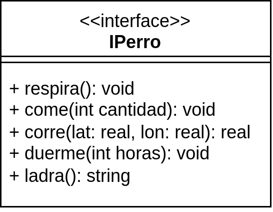
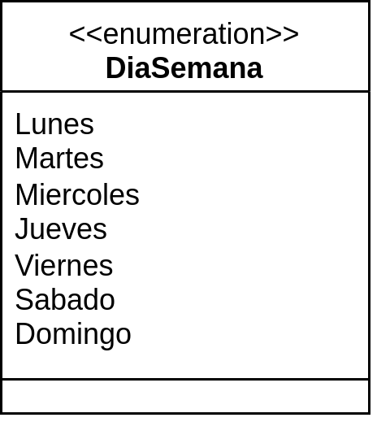
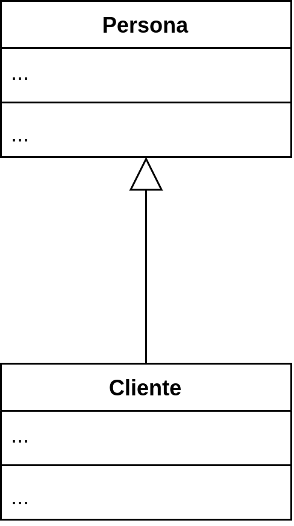
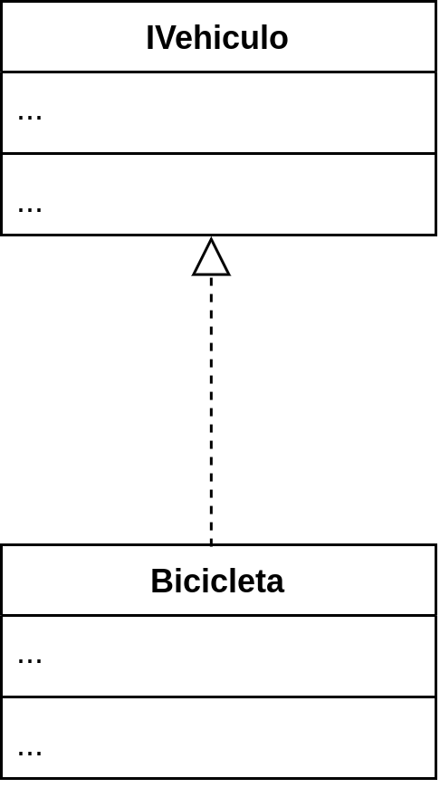
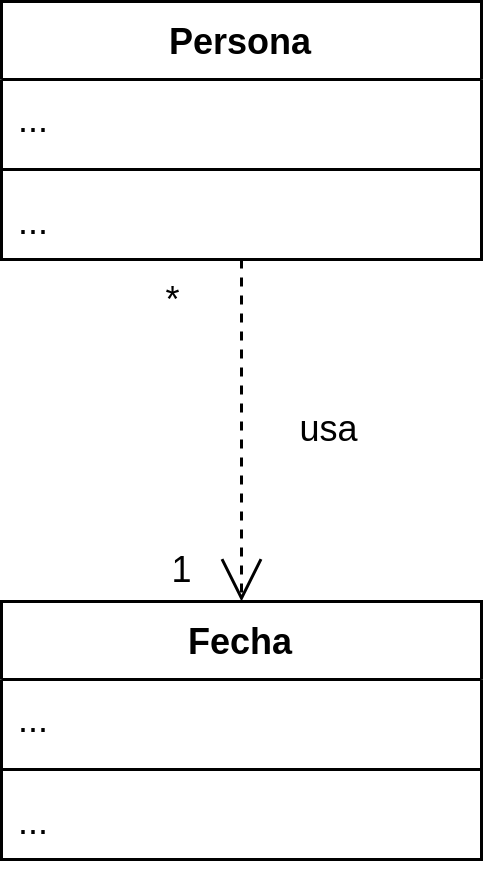
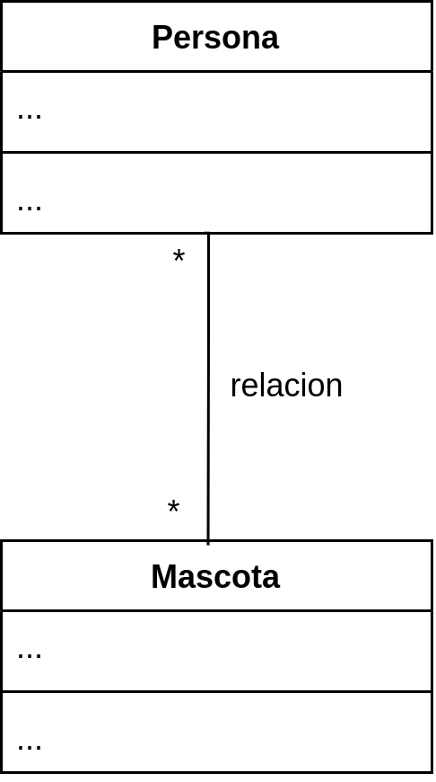
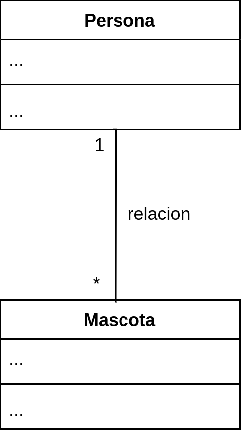
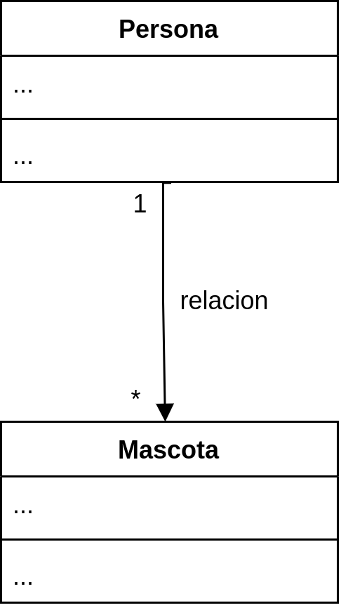
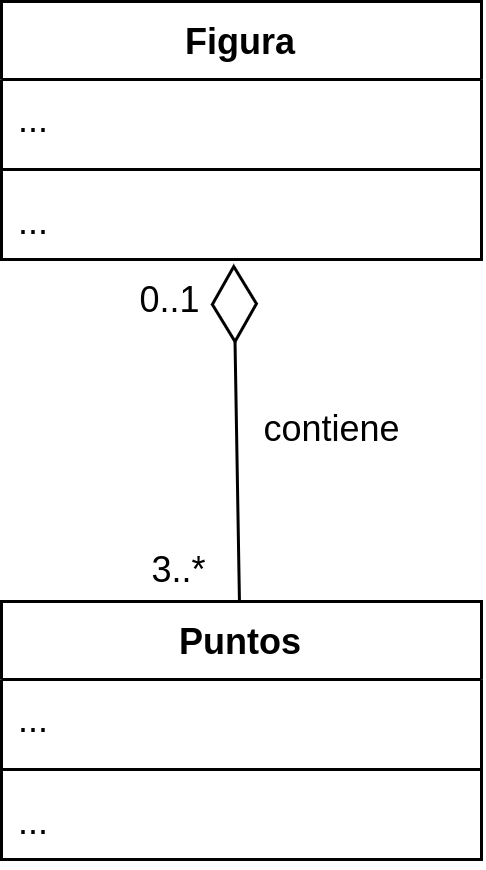
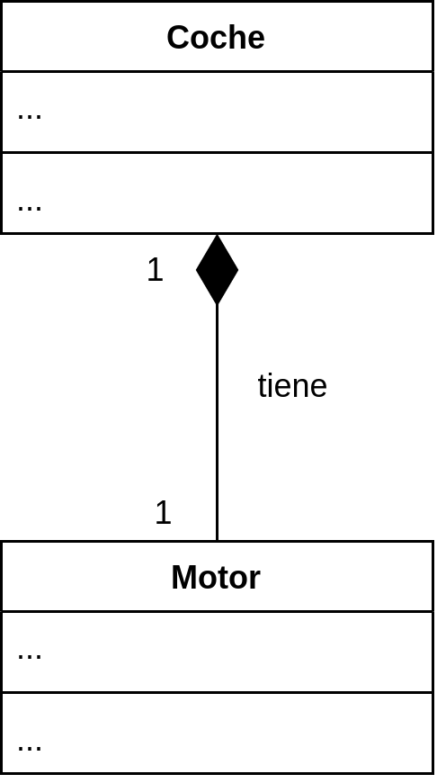

# UML: de diagrama de clases a código Java
Los diagramas de clases son un modelo conceptual muy útil para que los programadores puedan comunicar sus ideas, estructuras, patrones… sin ambigüedades. Todo diagrama de clases tiene su conversión a código y es muy importante saber hacerlo en el lenguaje que uses.

En este apartado te voy a explicar cómo convertir los diagramas de clases a código Java.

## Clases, clases abstractas, interfaces y enumeraciones
<table>
	<tr>
		<td>
			
		</td>
		<td>
			<pre>
				<code>
public class Bibicleta {
    private int platos;
    private int coronas;

    public int getVelocidades() {
        // ...
    }
}
</code>
	</pre>
		</td>
	</tr>
</table>

<table>
	<tr>
		<td>
			
		</td>
		<td>
<pre>
<code>
public abstract class Animal {
    protected String nombre;
    protected int edad;
    protected boolean estaVivo;

    public boolean estaVivo() {
        ...
    }

    public void morir() {
        ...
    }

    public abstract String emitirSonido();
    public abstract void moverse();
    public abstract void comer();
}
</code>
</pre>
		</td>
	</tr>
</table>

<table>
	<tr>
		<td>
			
		</td>
		<td>
<pre>
<code>
public interface IPerro {
    public void respira();
    public void come();
    public float corre(float lat, float lon);
    public void duerme(int horas);
    public String ladra();
}
</code>
</pre>
		</td>
	</tr>
</table>

<table>
	<tr>
		<td>
			
		</td>
		<td>
<pre>
<code>
public enum DiaSemana {
    Lunes,
    Martes,
    Miercoles,
    Jueves,
    Viernes,
    Sabado,
    Domingo;
}
</code>
</pre>
		</td>
	</tr>
</table>

## Herencia e implementación
<table>
	<tr>
		<td>
			
		</td>
		<td>
<pre>
<code>
public class Persona {
    ...
}

public class Cliente extends Persona {
    ...
}
</code>
</pre>
		</td>
	</tr>
</table>

<table>
	<tr>
		<td>
			
		</td>
		<td>
<pre>
<code>
public interface IVehiculo {
    ...
}

public class Bicicleta implements IVehiculo {
    ...
}
</code>
</pre>
		</td>
	</tr>
</table>

## Dependencia
<table>
	<tr>
		<td>
			
		</td>
		<td>
<pre>
<code>
public class Persona {
    ...

    public int diasDesde(Fecha fecha) {
        ...
    }
}

public class Fecha {
    ...
}
</code>
</pre>
		</td>
	</tr>
</table>

## Asociación
Las asociaciones generan un código diferente en base a si la relación es unidireccional o bidireccional. También afecta la multiplicidad. Te muestro ejemplos para que lo entiendas:

<table>
	<tr>
		<td>
			
		</td>
		<td>
<pre>
<code>
public class Persona {
    private List<Mascota> mascotas;

    ...
}

public class Mascota {
    private List<Persona> responsables;

    ...
}
</code>
</pre>
		</td>
	</tr>
</table>

<table>
	<tr>
		<td>
			
		</td>
		<td>
<pre>
<code>
public class Persona {
    private List<Mascota> mascotas;

    ...
}

public class Mascota {
    private Persona responsable;

    ...
}
</code>
</pre>
		</td>
	</tr>
</table>

<table>
	<tr>
		<td>
			
		</td>
		<td>
<pre>
<code>
public class Persona {
    private List<Mascota> mascotas;

    ...
}

public class Mascota {
    ...
}
</code>
</pre>
		</td>
	</tr>
</table>

## Agregación
<table>
	<tr>
		<td>
			
		</td>
		<td>
<pre>
<code>
public class Figura {
    private List<Punto> puntos;

    ...
}

class Punto {
    ...
}
</code>
</pre>
		</td>
	</tr>
</table>

## Composición
<table>
	<tr>
		<td>
			
		</td>
		<td>
<pre>
<code>
public class Coche {
    private Motor motor;

    ...
}

class Motor {
    ...
}
</code>
</pre>
		</td>
	</tr>
</table>
