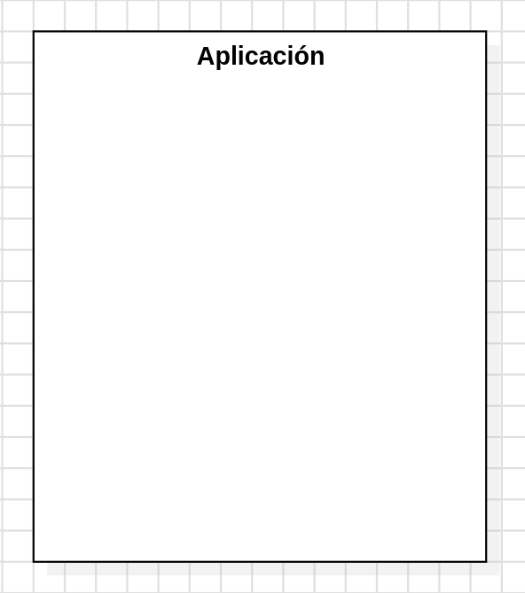
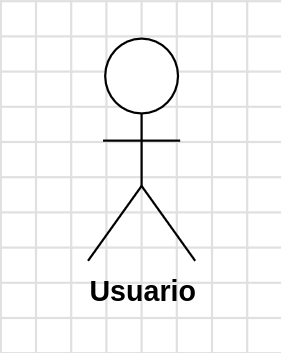
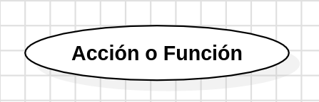
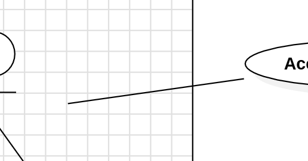
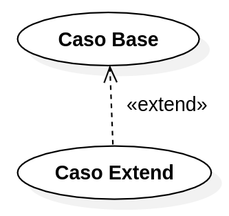
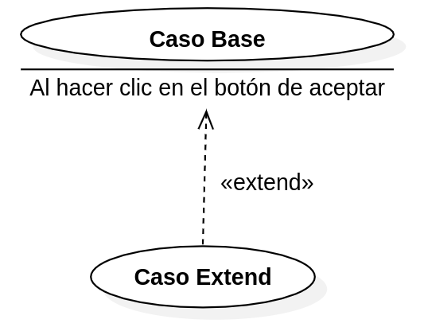
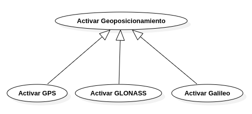
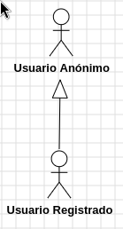
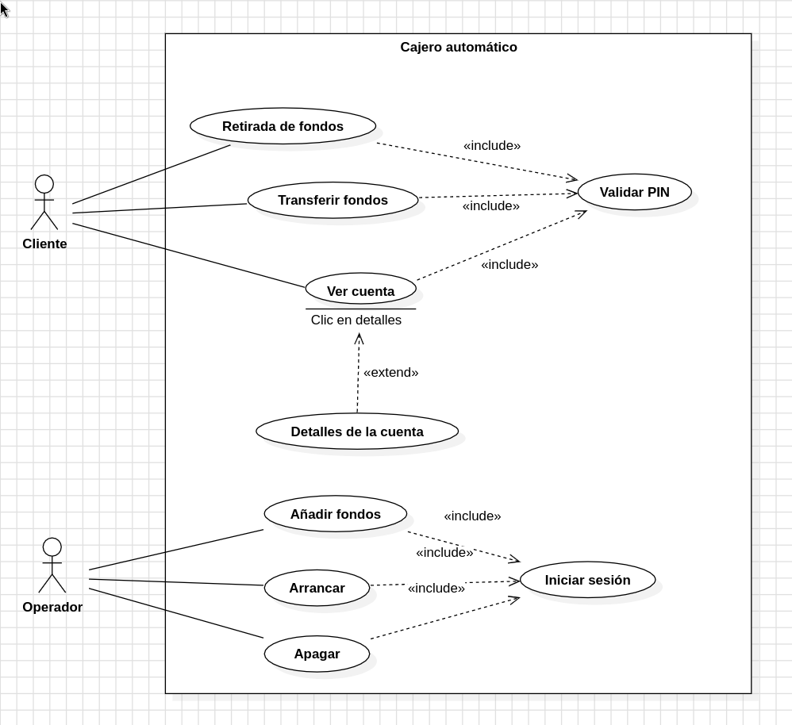

# Diagramas de Casos de Uso
Los Diagramas de Casos de Uso son unos diagramas que ofrecen un modelo de alto nivel donde se modelan y defininen las interacciones entre los actores y el sistema.

No se entre en detalles porque así la comunicación es más sencilla entre los desarrolladores del sistema en las primeras fases.

Además, estos casos de uso facilitan los escenarios de prueba.

## Símbolos
Estos son los símbolos que podemos encontrar en un Diagrama de Casos de Uso:

- Sistema: representa la aplicación o parte de la misma que pretendemos modelar y describir.



- Actor: representa a los usuarios, servicios y otros elementos que interactuan y ralizan acciones en el sistema.



- Caso de uso: representa una acción o función dentro del sistema.



- Asociación: representa una acción realizada por un actor (mediante una línea).



- Dependencia *include*: representa casos de uso incluidos en otros casos de uso base. Cuando un caso de uso base tiene un caso de uso *include* entonces el caso de uso *include* se lanzará cuando se lance el caso de uso base.


- Dependencia *extend*: representa casos de uso extendidos de otros casos de uso base. Cuando un caso de uso base tiene un caso de uso *extend* entonces el caso de uso *extend* se puede lanzar cuando se produzca una condición dada por lo que se denomina *extension point*.





- Generalización: que puede ser de casos de uso o de actores, se usan para reutilizar casos de uso o actores, según el caso.





## Guía para responder a los ejercicios
Cuando te enfrentes a un ejercicio en el que tengas que interpretar un Diagrama de Casos de Uso tienes que hacer alusión a:

- Los actores y sus roles.
- Listar y nombrar los casos de uso que pueden realizar estos actores.
- Describir cada caso de uso indicando si tiene casos de uso incluidos (*include*) o extendidos (*extend*), aludiendo a los *extension points* en el caso de los casos de uso extendidos.
- También tendrás que hacer alusión a las generalizaciones que puedas ver, tanto de los actores como de los casos de uso.

Además, cuando hagas alusión a los roles de los actores y los nombres de los casos de uso ponlos entre comillas.

Esta podría ser la estructura a utilizar:

1. Lista los roles de los actores y junto a ellos indica el nombre de los casos de uso que realizan.
2. A continuación, nombra los casos de uso que tengan casos de uso incluidos y casos de uso extendidos. En estos últimos, además, especifica cuándo se desencadenan, bajo qué circunstancias (hecho que viene indicado en los *extension points*).
3. Por último, no olvides indicar si hay generalizaciones entre actores o casos de uso.

Por ejemplo, imagina este Diagrama de Casos de Uso:



Una descripción e interpretación del mismo sería:

```text
Se tienen dos actores:

- Actor con el rol “Cliente”: realiza tres casos de uso: “Retirada de fondos”, “Transferir fondos” y “Ver cuenta”.

- Actor con el rol “Operador”: realiza tres casos de uso: “Añadir fondos”, “Arrancar” y “Apagar”.

En cuanto a los casos de uso, cabe señar que:

- Los casos de uso "Retirada de fondos", "Transferir fondos" y "Ver cuenta" desencadenan en caso de uso incluido "Validar PIN".

- El caso de uso "Ver cuenta" desencadena el caso de uso extendido "Detalles de la cuenta" si el usuario hace clic en los detalles de la cuenta como podemos ver en el extension point "Clic en detalles".

- Los casos de uso "Añadir fondos", "Arrancar" y "Apagar" desencadenan el caso de uso incluido "Validar PIN".
```

En este ejemplo podemos ver que se cumplen todos los puntos de la siguiente lista de cotejo:

> Esta es la lista de cotejo que usaré en todas las prácticas y exámenes para la interpretación de los casos de uso.

- ¿Se hace alusión a todos los actores, indicando sus roles entre comillas? **Sí**
- ¿Se indica qué casos de uso tiene asociados cada actor, indicando los casos de uso entre comillas? **Sí**
- ¿Se indica qué casos de uso tienen casos de uso incluidos? **Sí**
- ¿Se indica qué casos de uso tienen casos de uso extendidos, indicando y haciendo alusión a los *extension point* que desencadenarían dicho caso de uso extendido? **Sí**
- ¿Se indican las generalizaciones entre actores? **No las hay**
- ¿Se indican las generalizaciones entre casos de uso? **No las hay**
