# Diagramas de Secuencia
Estos diagramas con el tipo más común de Diagramas de Interacción, que se centra en el intercambio de mensajes entre varias líneas de vida.

El Diagrama de Secuencia describe una interacción centrándose en la secuencia de mensajes que se intercambian junto con sus correspondientes especificaciones de ocurrencia en las líneas de vida.

Básicamente, en estos diagramas se modela cómo los objetos interactúan entre sí en un sistema durante la ejecución de un escenario.

La intención de Los Diagramas de Secuencia no son mostrar lógicas de procedimientos complejas, así que hay que mantener la simplicidad en la medida de lo posible.

> Dependiendo de lo que vaya a modelar, los **objetos** podrán ser las partes del sistema, usuarios... o, directamente, clases que forman el programa.

## Símbolos
Estos son los símbolos que podemos encontrar en un Diagrama de Secuencia:

### Diagrama de Secuencia (sd)
Los Diagramas de Secuencia se dibujan dentro de una rectángulo en el que se indica un nombre arriba a la izquierda, tras las iniciales **sd** (*sequence diagram*).

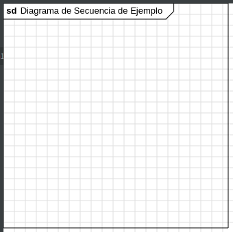

### Línea de vida
La **línea de vida** (en inglés **lifeline**) es un **elemento con nombre** que representa la secuencia temporal de una **instancia particular de un objeto** durante la ejecución de un escenario o interacción.

Dicha línea de vida se representa por medio de un **rectángulo** que contiene un nombre en su interior y del que sale una **línea discontinua vertical** que representa la vida del participante.

Cuando los objetos son objetos de la programación orientada a objetos, el nombre indicado en el interior del rectángulo indica el objeto y la clase. Por ejemplo:

- `cliente:Usuario` indica que la línea de vida es del objeto llamado `cliente` de la clase `Usuario`
- `:Usuario` indica que la línea de vida es de un objeto de la clase `Usuario` (a veces no importa el objeto concreto del que se trata, porque el comportamiento va a ser el mismo)

En otro caso, el nombre del objeto indicará el sistema, actor, usuario... al que se refiere, sin más.

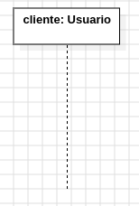

### Ocurrencia de ejecución
La **ocurrencia de ejecución** (en inglés *execution ocurrence*) es un rectángulo a lo largo de la línea discontinua de una línea de vida que representa momentos en el tiempo en los que las acciones comienzan o terminan.

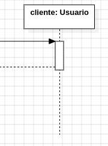

Un ejemplo, algo más completo, para que lo vayas entendiendo, es el que se muestra a continuación. En este se ven **tres ocurrencias de ejecución** en **dos líneas de vida**:

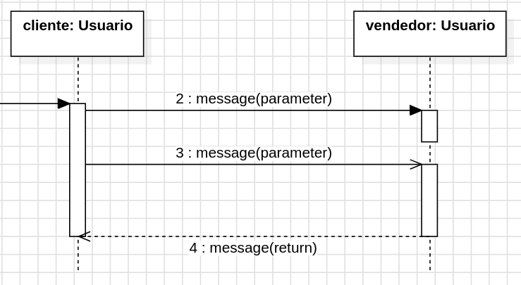

Ahora mismo llamará tu atención las flechas. En el siguiente apartado te hablo de ellas.

### Mensajes
Los mensajes representan interacciones entre los objetos durante la ejecución de un escenario.

Se usan flechas dirigidas desde el objeto remitente al objeto destinatario y pueden tener diferentes tipos y características:

Los mensajes son representados por flechas. Los mensajes pueden ser:

- **Mensajes síncronos** (*synchronous*): estos son mensajes en los que el remitente **espera una respuesta del destinatario antes de continuar** su propia ejecución. Se representan con una **línea continua con punta cerrada**. El remitente no continúa su ejecución hasta que reciba la respuesta del destinatario:

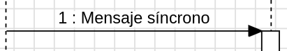

- **Mensajes asíncronos** (*asynchronous*): estos mensajes **no requieren una espera activa** del remitente para recibir una respuesta inmediata del destinatario. Se representa con una **línea continua con punta abierta**.

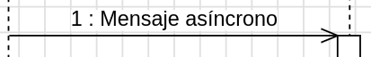

- **Auto mensajes** (*self message*): un auto mensaje representa una llamada **recursiva** de una operación o un **método que llama a otro método que pertenece al mismo objeto**.

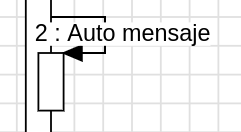

- **Mensajes de llamada** (*call*): estos mensajes **invocan un comportamiento específico en el objeto destinatario**. Se usan para representar llamadas a métodos u operaciones en el objeto destinatario. Se representan con una **flecha continua con punta cerrada**.

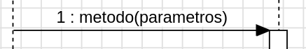

- **Mensajes de retorno o respuesta** (*return* o *reply*): estos mensajes **indican la respuesta o retorno de una llamada previa**. Se muestran con una **flecha discontinua** desde el objeto destinatario al remitente.

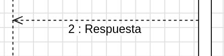

- **Mensajes de señal** (*signal*): representan señales que se pueden dar en el sistema. A diferencia de una llamada, las señales no están directamente asociados con la invocación de métodos específicos, sino más bien con la notificación de que un evento ha ocurrido. Se usan **flechas continuas con punta abierta**.

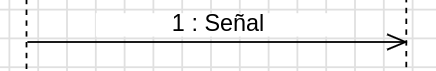

- **Mensajes de creación** (*create*): estos mensajes representan la **creación de nuevas instancias de objetos**. Se usan para indicar que un objeto crea una nueva instancia de otra clase. Se representan con una **flecha discontinua** y una etiqueta "create" arriba entre paréntesis angulares.

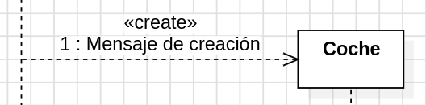

- **Mensajes de destrucción** (*delete*): estos mensajes indican la **destrucción de una instancia de objeto**. Se utilizan para representar el fin de vida de una instancia de objeto. Se representan con una **flecha continua con punta cerrada** y una etiqueta "destroy" arriba entre paréntesis angulares.

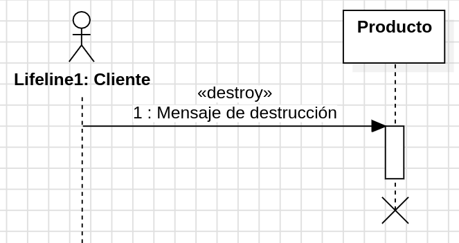

- **Mensajes perdidos y encontrados** (*lost* y *found*): los mensajes perdidos son aquellos enviados a un destino al que no llega o no se conoce (no se muestra en el diagrama). Los mensajes encontrados son aquellos que llegan pero cuyo origen se desconoce o no se encuentra en el diagrama. Se reprsentan con líneas continuas en cuyo origen o destino se tiene un círculo relleno de color negro, según sea perdido o encontrado.

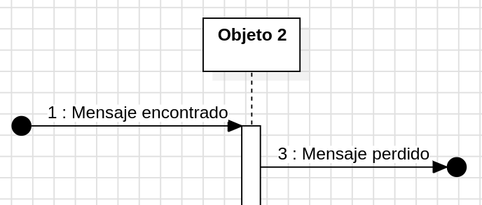

## Fragmentos combinados
Aunque, como comenté al principio, estos diagramas de secuencia no tienen que ser muy complejos en cuanto a la lógica, sí existen una serie de mecanismos para explicitar cierto grado de la lógica de los procedimientos: los fragmentos combinados (*combined fragments*).

Algunos de estos fragmentos son:

- Fragmentos alternativos (**alt**): *if..then..else*
- Fragmentos opcionales (**opt**): *switch*
- Fragmentos para repeticiones o bucles (**loop**): para representar repeticiones o bucles

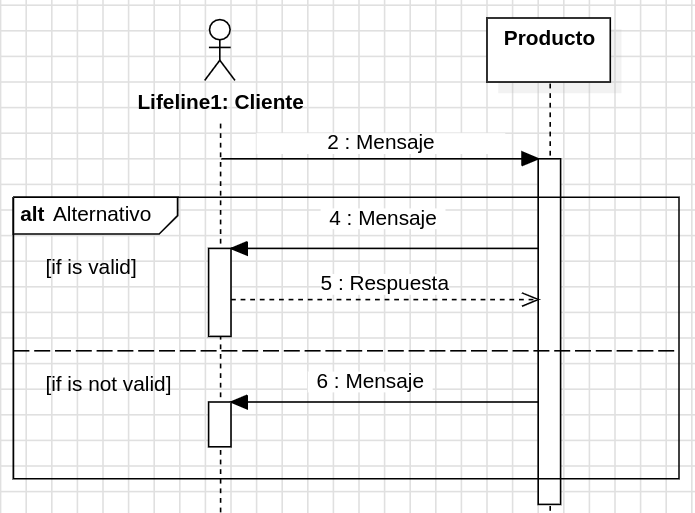

## Puerta o *gate*
Una puerta o *gate* es un punto para conectar un mensaje dentro de un fragmento con un mensaje fuera de un fragmento.

Cuando un diagrama de secuencia es demasiado grande o complejo para ser representado en una sola vista, se puede dividir en varios fragmentos más pequeños. Estos fragmentos se pueden conectar mediante puertas, que actúan como puntos de conexión entre ellos. Las puertas se representan visualmente como pequeños rectángulos en el borde del fragmento, con una etiqueta que indica si es una entrada (entrada) o salida (salida).

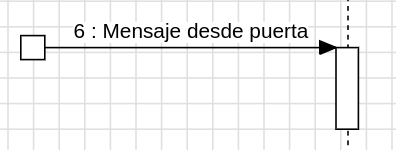

## Invariante de estado
Un **invariante de estado** (*state invariant*) son condiciones que deben mantenerse verdaderas para un objeto en un estado particular en cualquier momento dado.

Por ejemplo, en un sistema de reserva de vuelos, un invariante de estado podría ser que la fecha de salida del vuelo siempre sea anterior a la fecha de llegada.

La invariante de estado generalmente se muestra como una **restricción entre llaves** en la línea de
vida:

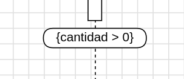.

## Continuación
Las **continuaciones** (*continuations*) son acciones o eventos que puden ocurrir después de que complete una transición en un modelo de estado. Representan las posibles ramificaciones o caminos que el sistema puede tomar después de haber alcanzado un estado determinado.

Por ejemplo, en un sistema de reserva de vuelos, después de que un pasajero haya realizado con éxito una reserva, la continuación podría ser el envío de un correo electrónico de confirmación o la actualización de la disponibilidad de asientos.

Las continuaciones se representan como una nota asociada con una especificación de ocurrencia:

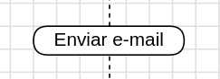

## Ejemplos
En el primer ejemplo vamos a modelar un sistema y en el segundo ejemplo un programa.

En el primero verás que se tienen sistemas y usuarios. Además, los mensajes son textos cortos describiendo lo que sucede.

En el segundo verás que se tienen clases y objetos. Los mensajes, en este caso, serán llamadas a métodos.

### Modelando el funcionamiento de un cajero
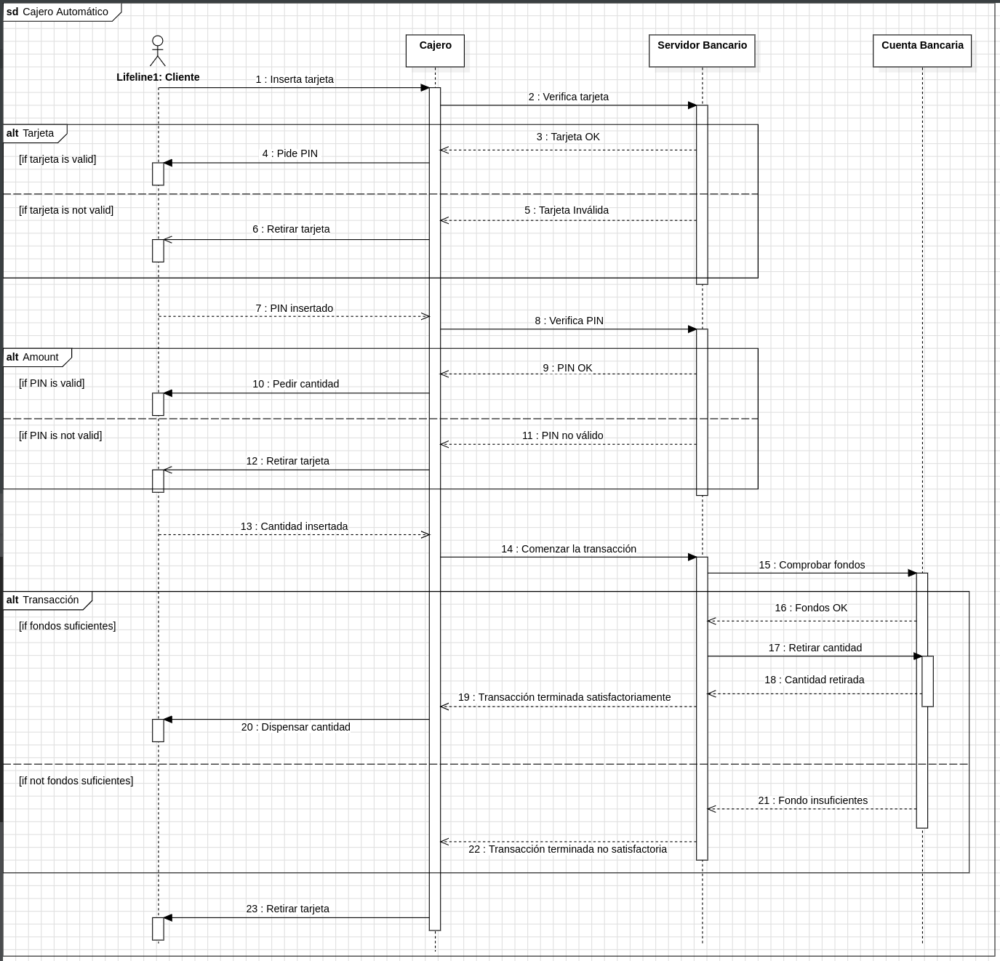

### Modelando un programa orientado a objetos
